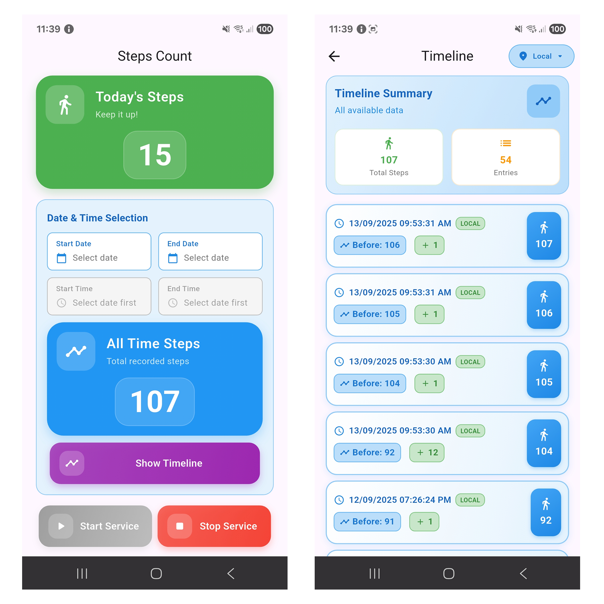

# Steps Count

A Flutter plugin for counting steps and managing step tracking services on both Android and iOS devices. This plugin provides comprehensive step counting functionality with background service support on Android, HealthKit integration on iOS, timeline data retrieval, and robust permission handling.

## Preview

<p align="center">
  
</p>

## Features

- 🚶 **Step Counting**: Get real-time step counts and historical data
- ⚡  **Background Service**: Continuous step tracking even when app is closed (Android)
- 🏥 **HealthKit Integration**: Native iOS health data access with privacy compliance
- 📊 **Timeline Data**: Detailed step history with timestamps
- 🕒 **Date Range Queries**: Flexible date-based step count retrieval
- 🌍 **Timezone Support**: Local and UTC timezone handling
- 🔄 **Auto-restart**: Service automatically restarts on device reboot (Android)
- 📱 **Cross-platform**: Optimized for both Android and iOS with platform-specific implementations

## Platform Support

| Platform | Support | Features |
|----------|---------|----------|
| Android  | ✅      | Background service, auto-restart, sensor-based tracking |
| iOS      | ✅      | HealthKit integration, privacy-compliant data access |

## Installation

Add this to your `pubspec.yaml`:

```yaml
dependencies:
  steps_count: ^0.0.2
  permission_handler: ^12.0.1  # Required for Android runtime permissions
```

## Configuration

### Android Setup

#### 1. Permissions

Add the following permissions to your `android/app/src/main/AndroidManifest.xml`:

```xml
<manifest xmlns:android="http://schemas.android.com/apk/res/android">
    
    <!-- Required permissions for step counting -->
    <uses-permission android:name="android.permission.ACTIVITY_RECOGNITION" />
    <uses-permission android:name="android.permission.POST_NOTIFICATIONS" />
    <uses-permission android:name="android.permission.FOREGROUND_SERVICE" />
    <uses-permission android:name="android.permission.FOREGROUND_SERVICE_HEALTH" />
    
    <!-- Auto-start permissions -->
    <uses-permission android:name="android.permission.RECEIVE_BOOT_COMPLETED" />

    <application>
        <!-- Your existing application configuration -->
        
        <!-- Add the background service -->
        <service
            android:name="com.dajiraj.steps_count.BackgroundServiceManager"
            android:enabled="true"
            android:exported="false"
            android:foregroundServiceType="health" />
            
        <!-- Add boot receiver for auto-start -->
        <receiver android:name="com.dajiraj.steps_count.BootServiceManager"
            android:enabled="true"
            android:exported="true"
            android:directBootAware="true">
            <intent-filter android:priority="1000">
                <action android:name="android.intent.action.BOOT_COMPLETED" />
                <action android:name="android.intent.action.LOCKED_BOOT_COMPLETED" />
                <action android:name="android.intent.action.USER_UNLOCKED" />
                <action android:name="android.intent.action.USER_PRESENT" />
                <action android:name="android.intent.action.MY_PACKAGE_REPLACED" />
                <action android:name="android.intent.action.QUICKBOOT_POWERON" />
                <category android:name="android.intent.category.DEFAULT" />
            </intent-filter>
            <intent-filter>
                <action android:name="android.intent.action.MY_PACKAGE_REPLACED" />
                <data android:scheme="package" />
            </intent-filter>
        </receiver>
        
    </application>
</manifest>
```

#### 2. Runtime Permissions

Request the `ACTIVITY_RECOGNITION` and `NOTIFICATION` permissions at runtime (Android 10+):

```dart
import 'package:permission_handler/permission_handler.dart';

Future<bool> requestPermissions() async {
  // Request both permissions
  final Map<Permission, PermissionStatus> statuses = await [
    Permission.activityRecognition,
    Permission.notification,
  ].request();

  final activityStatus = statuses[Permission.activityRecognition]!;
  final notificationStatus = statuses[Permission.notification]!;

  return activityStatus.isGranted && notificationStatus.isGranted;
}

// Check if permissions are already granted
Future<bool> hasPermissions() async {
  final activityStatus = await Permission.activityRecognition.status;
  final notificationStatus = await Permission.notification.status;
  
  return activityStatus.isGranted && notificationStatus.isGranted;
}

// Handle permanently denied permissions
Future<void> handlePermanentlyDenied() async {
  final activityStatus = await Permission.activityRecognition.status;
  final notificationStatus = await Permission.notification.status;
  
  if (activityStatus.isPermanentlyDenied || 
      notificationStatus.isPermanentlyDenied) {
    // Guide user to app settings
    await openAppSettings();
  }
}
```

### iOS Setup

#### 1. HealthKit Configuration

Add HealthKit capability to your iOS app by adding the following to your `ios/Runner/Info.plist`:

```xml
<key>NSHealthShareUsageDescription</key>
<string>This app needs access to step count data to provide step tracking functionality.</string>
<key>NSHealthUpdateUsageDescription</key>
<string>This app needs to write step count data to HealthKit.</string>
```

#### 2. Enable HealthKit and Background Mode Capabilities

In Xcode:
1. Open `ios/Runner.xcworkspace`
2. Select your Runner target
3. Go to **Signing & Capabilities** tab
4. Click the "+" button and add **HealthKit** capability
5. Enable **HealthKit Background Delivery** to observe and receive updated data.
6. Click the "+" button again and add **Background Modes** capability
7. Enable **Background Fetch** and **Background Processing**.

#### 3. HealthKit Permissions

Request HealthKit permissions in your Flutter app with proper platform checks:

```dart
import 'package:steps_count/steps_count.dart';
import 'dart:io' show Platform;

final stepsCount = StepsCount();

// First check if running on iOS
if (Platform.isIOS) {
  // Check if HealthKit is available (iOS only)
  bool isAvailable = await stepsCount.isHealthKitAvailable();

  if (isAvailable) {
    // Check current permission status first
    bool hasPermission = await stepsCount.checkSingleHealthKitPermissionStatus(
      dataType: HealthDataType.stepCount,
    );
    
    if (!hasPermission) {
      // Request HealthKit permissions
      bool permissionGranted = await stepsCount.requestHealthKitPermissions(
        dataTypes: [HealthDataType.stepCount],
      );
      
      if (permissionGranted) {
        print('HealthKit permissions granted');
      } else {
        print('HealthKit permissions denied');
      }
    } else {
      print('HealthKit permissions already granted');
    }
  } else {
    print('HealthKit not available on this device');
  }
}
```

## Basic Setup

```dart
import 'package:steps_count/steps_count.dart';

final stepsCount = StepsCount();
```

#### Start Background Service (Android)

```dart
// Start the background step counting service only for android
await stepsCount.startBackgroundService();

// Check if service is running only for android
bool isRunning = await stepsCount.isServiceRunning();
print('Service running: $isRunning');
```

#### Get Step Counts

```dart
// Get today's step count
int todaySteps = await stepsCount.getTodaysCount();
print('Steps today: $todaySteps');

// Get steps for a specific date range
int weekSteps = await stepsCount.getStepCounts(
  startDate: DateTime.now().subtract(Duration(days: 7)),
  endDate: DateTime.now(),
);
print('Steps this week: $weekSteps');
```

#### Timeline Data

```dart
// Get detailed timeline with timestamps
List<TimelineModel> timeline = await stepsCount.getTimeline(
  startDate: DateTime.now().subtract(Duration(days: 30)),
  endDate: DateTime.now(),
  timeZone: TimeZoneType.local,
);

for (final entry in timeline) {
  print('${entry.dateTime}: ${entry.stepCount} steps');
}
```

#### Stop Service (Android)

```dart
// Stop the background service only for android
await stepsCount.stopBackgroundService();
```

## API Reference

### Methods

| Method | Return Type | Description | Platform |
|--------|-------------|-------------|----------|
| `startBackgroundService()` | `Future<void>` | Starts the background step counting service | Android |
| `stopBackgroundService()` | `Future<void>` | Stops the background step counting service | Android |
| `isServiceRunning()` | `Future<bool>` | Checks if the background service is running | Android |
| `isHealthKitAvailable()` | `Future<bool>` | Checks if HealthKit is available | iOS |
| `requestHealthKitPermissions({dataTypes})` | `Future<bool>` | Requests HealthKit permissions | iOS |
| `checkHealthKitPermissionStatus({dataTypes})` | `Future<Map<String, bool>>` | Checks multiple HealthKit permission statuses | iOS |
| `checkSingleHealthKitPermissionStatus({dataType})` | `Future<bool>` | Checks single HealthKit permission status | iOS |
| `getTodaysCount()` | `Future<int>` | Gets step count for today | Both |
| `getStepCounts({startDate, endDate})` | `Future<int>` | Gets total steps for date range | Both |
| `getTimeline({startDate, endDate, timeZone})` | `Future<List<TimelineModel>>` | Gets detailed timeline data | Both |


## Contributing

Contributions are welcome! Please feel free to submit a Pull Request.

## License

This project is licensed under the MIT License - see the [LICENSE](LICENSE) file for details.

## Support

If you encounter any issues or have questions, please file an issue on the [GitHub repository](https://github.com/Dajiraj-Infotech/steps_count).